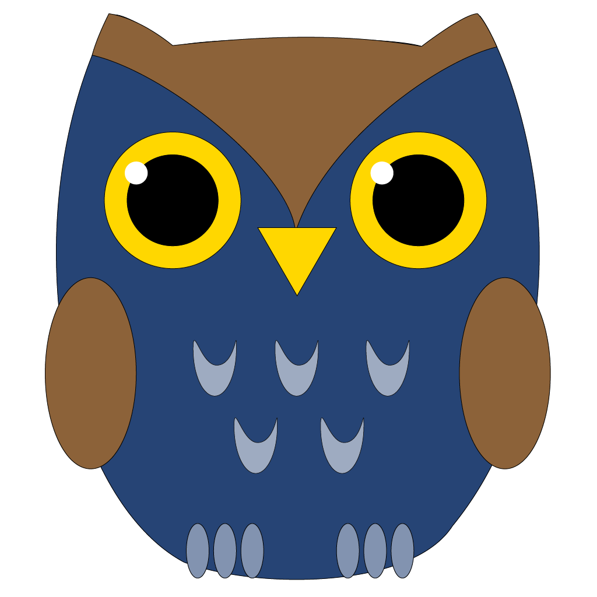

# Theodor

A happy and wise Slack-bot for the UCSD Library, or so we've been told.

## What can it do?

### Events
1. The bot will post to the `#general` channel when a new channel is created.
1. The bot will welcome a new user to the team with a customized welcome message

### Commands
1. `hours` - responds with Library building(s) hours for the day
1. `service desk` - responds with options for contacting the service desk

In time, assuming interest, additional bot-like features will be added.

## Installing (docker)
1. Clone the repo: `git clone https://github.com/ucsdlib/theodor.git`
1. Build image: `docker build -t theodor .`

Run rubocop or tests:
1. `docker run --rm theodor bundle exec rubocop`
1. `docker run --rm theodor bundle exec rake`

## Installing (traditional)
1. Clone the repo: `git clone https://github.com/ucsdlib/theodor.git`
1. Install dependencies: `bundle install`
1. Run test suite `rake`. This will also run `rubocop` in addition to `rspec`
1. Run application `SLACK_API_TOKEN=<your-token> bundle exec puma`

## Kubernetes Deploy
> Note: this is not how we've deployed the bot. YMMV

1. A working kubernetes cluster: `minikube start`
1. An install of helm and kubectl
1. Tiller in the cluster: `helm init`
1. A secret.yaml installed on the cluster like `theodor/secret.yaml` with your
   API token base64-encoded
1. Install secret: `kubectl create -f theodor/secret.yaml`

1. Dry Run/Debugging: `helm install --dry-run --debug ./theodor`
1. Real Deal Run: `helm install --name theodor ./theodor`
